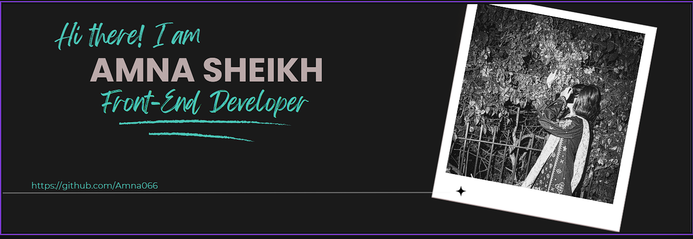

 

  

###

<h1 align="left">{ Amna Sheikh }</h1>

###

⚡ BSIT Student | UI/UX Designer | Mobile & Frontend Developer.

###

<h3 align="left">🌐 Developer Persona </h3>

###

I specialize in combining intuitive UI/UX design with clean frontend development, creating seamless mobile and web applications that focus entirely on user experience. Leveraging cross-platform frameworks like React Native and Flutter alongside Android Studio, I transform wireframes and visual design concepts into high-performance, responsive interfaces. My work focuses on building fully optimized layouts, ensuring smooth animations, clean typography, and exceptional usability at every step.

###

<h3 align="left">🪐 Tech Ecosystem </h3>

###

 

  
  
  
  
  
  
  
  
  
  
  
  
  
  
  
  
  
  
  

###

<h3 align="left">🧩 Research & Innovation</h3>

###

I'm passionate about the intersection of elegant presentation layouts and mobile application architectures. Currently exploring advanced UI interaction states, interactive user experience prototyping, and structural asset scaling for clean web and mobile exports.

###

<picture>
  <source media="(prefers-color-scheme: dark)" srcset="https://raw.githubusercontent.com/Amna066-tech/Amna066-tech/output/pacman-contribution-graph-dark.svg">
  <source media="(prefers-color-scheme: light)" srcset="https://raw.githubusercontent.com/Amna066-tech/Amna066-tech/output/pacman-contribution-graph.svg">
  
</picture>

###

  
  

